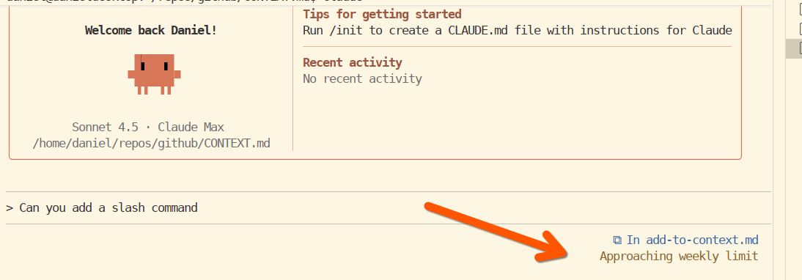

# Feature Request: Make the Usage Warning Hideable

**Source:** GitHub Issue #10433
**Author:** Daniel Rosehill
**Date:** October 27, 2025
**Labels:** enhancement, area:tui
**Status:** Open

## Problem Statement

The persistent usage warning display can be distracting and stress-inducing for some users, even when they're only at 75% of their quota and have backup options available (such as a work account).

The constant visibility of this warning, while well-intentioned, creates unnecessary cognitive load for users who are already aware of their usage and have plans to manage it.

## Proposed Solutions

### Option 1: Threshold-Based Display

The warning only appears at specific critical thresholds rather than continuously:
- First warning at 70% of usage
- Final warning at 95% of usage (quota almost reached)
- Optionally send notification emails at these thresholds

This approach ensures users are informed without the warning being constantly present.

### Option 2: User Preference Setting

Make this a configurable setting that allows users to:
- Show warnings continuously (default behavior)
- Show warnings only at critical thresholds
- Minimize or eliminate usage messages entirely
- Choose their preferred notification method (UI, email, or both)

## Benefits

- Reduces cognitive load and distraction for users who find persistent warnings stressful
- Provides flexibility for different user preferences and working styles
- Maintains important usage information for those who want it
- Demonstrates consideration for neurodivergent users and different attention management needs

## Alternative Solutions

- Browser extension or user script to hide the element (not ideal as it requires technical knowledge)
- CSS customization options (limited accessibility)

## Priority

Low — Nice to have, but could significantly improve user experience for certain individuals.

## Feature Category

UI/UX Enhancement, Accessibility

## Additional Context

While this may seem like a minor concern to some users, it represents an important consideration for inclusive design. Different users have different relationships with persistent UI notifications, and providing options to accommodate these preferences aligns with Claude's mission of being helpful and considerate.

The request acknowledges that this is a personal preference issue, but suggests it's worth considering adding a "UI Suggestions" category for these types of accessibility and preference-based enhancement requests.
