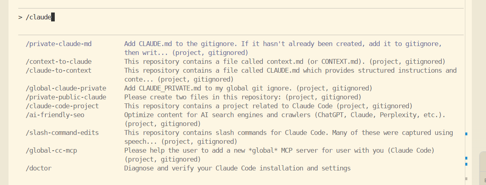
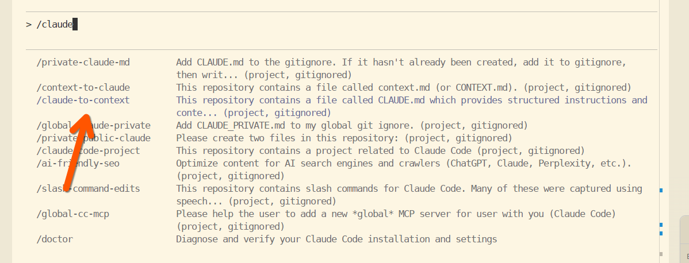
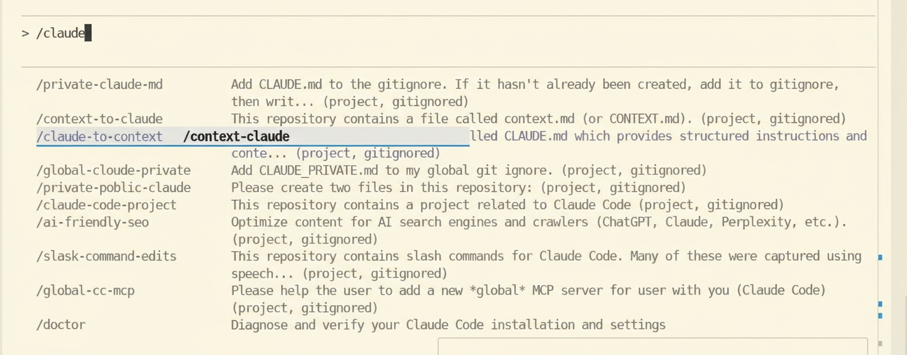

# Feature Request: Enhance Contrast Between Highlighted and Non-Highlighted Slash Commands

**Source:** GitHub Issue #10511
**Author:** Daniel Rosehill
**Date:** October 28, 2025
**Labels:** enhancement, area:tui, area:a11y
**Status:** Open

## Problem Statement

When you have multiple slash commands starting with the same prefix, it's very difficult to see which one you're currently highlighting because the text contrast between purple and black is quite marginal.

This creates a usability issue, particularly when navigating through similar slash commands, as users cannot easily identify which command is currently selected.

### Current State

The screenshots above demonstrate the low contrast between highlighted and non-highlighted slash commands, making it difficult to distinguish which command is active.

## Proposed Solution

Enhance the visual distinction of highlighted slash commands through one or more of the following UI improvements:

- **Bold font** for the highlighted slash command
- **Light background shading** behind the highlighted item
- **Underline** for the highlighted text
- **All of the above** for maximum visibility

### Mockup

The following mockup (created via Nano Banana) demonstrates the proposed enhancement with improved visual contrast:

## Benefits

- Improved usability when navigating slash command lists
- Better accessibility for users with visual impairments
- Reduced cognitive load when selecting commands
- More intuitive interface interaction

## Priority

High — Significant impact on productivity, especially for power users who work with many custom slash commands.

## Feature Category

UI/UX Enhancement, Accessibility

## Additional Context

This enhancement is particularly important as users create more custom slash commands with similar prefixes. The current low-contrast highlighting makes navigation frustrating and error-prone.
